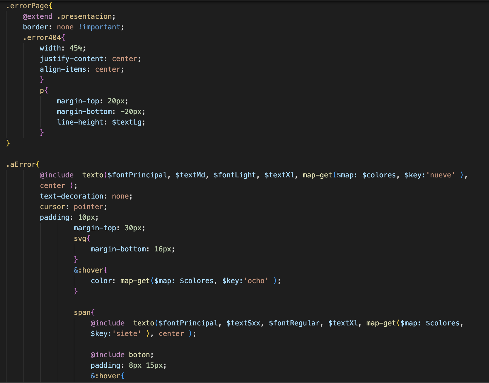

<h1 align="center"> Priscila </h1>
 
 

 

  
<h2>Proceso </h2>

Este <strong>Repo</strong> es mi proyecto final para el curso de <strong> Desarrollo Web - CODERHOUSE </strong>

Qué puedo decir que me deja este curso?, a parte del contenido muy bien presentado y enseñado: Todo se resume en estudiar, practicar, probar, investigar y ponerle muchas ganas :grin: .

A continuación, el desarrollo del proyecto...

***
 
 

 
 Pantalla de inicio del proyecto

 
 ***
 
 <h2>  :nerd_face: HERRAMIENTAS</h2>

<h3>Herramientas que manejaba previamente y fueron utilizadas en este proyecto</h3>

 
 <h3>Herramientas y conocimientos adquiridos en este curso y utilizados en este proyecto</h3>
 

 

 

***

  <h2> :rocket: WEB :rocket: </h2>
  <h3> Contenido de la Web: </h3>
  
Consiste en una web de 5 html principales, más las páginas de error.

  <ul>
    <li>Index: Home del Sitio Web donde muestro mis últimos trabajos realizados y una sección de Testimonios.</li>
    <li>Trabajos: Muestro los trabajos realizados y mis características principales a la hora de trabajar.       </li>
    <li>Sobre Mí: Sección donde se pueden ver mis estudios realizados, herramientas que utilizo y algunas de mis cualidades.</li>
    <li>Curiosidad: Sección donde cuento la historia del isotipo de la web.</li>
    <li>Contacto: Formulario para poder contactarse.</li>
    <li>Error403: Página de error 403, que se puede acceder desde el link de veo.com o en su imagen.</li>
    <li>Error404: Página de error 404,que se puede acceder desde el Título "Ilustración" o en su imagen. </li>
    <li>Error504: Página de error 504, que se puede acceder desde el botón "enviar" del formulario de contacto.</li>
  </ul>

***
<h2> :muscle: Desafíos </h2>

Me propuse algunos desafíos personales

<ul>
  <li>Usar cards de BS ("index.html") y tratar de replicarlas de manera casera ("trabajos.html "de portfolio).</li>
  <li>Realizar las pantallas de error totalmente personalizadas y caseras.</li>
  <li>Implementar todo lo posible lo aprendido a lo largo de la cursada, sin perder la idea del proyecto y su diseño. Dejar a la  vista el manejo de los lenguajes y las herramientas que aprendí a utilizar.</li>
</ul>

Estoy contenta con los resultados. Creo haber podido cumplir con las metas que me propuse y eso me anima a seguir avanzando.

  ***
  
  <h2>  :computer: Code sweet code </h2>
  <h4>Algunas fracciones de código:</h4>
  
  
  
Nesting

  
  
Mixin

  
  
Grid

  
  
Media query 

  
  ***

  ## 	:woman_technologist: WIREFRAMES ##
  <h3> Web:</h3>

<ul>
  <li>INDEX: https://wireframe.cc/B7u6xo</li>
  <li>TRABAJOS: https://wireframe.cc/UiQQ80</li>
  <li>SOBRE MI: https://wireframe.cc/CSDI0z</li>
  <li>FIRMA: https://wireframe.cc/uEXggb</li>
  <li>CONTACTO: https://wireframe.cc/S4sNCd</li>
  <li>ERROR: https://wireframe.cc/2Bb8pD</li>
</ul>

<h3>Móvil:</h3>
<ul>
  <li>INDEX: https://wireframe.cc/0dwfbb</li>
  <li>TRABAJO: https://wireframe.cc/0dwfbb</li>
  <li>SOBRE MI: https://wireframe.cc/Ae3rqm</li>
  <li>FIRMA: https://wireframe.cc/007U26</li>
  <li>CONTACTO: https://wireframe.cc/BAQrJr</li>
</ul>

***

Gracias por leer este readme!, fue hecho con muchas ganas al igual que este proyecto. Que tengas un buen día :grin: 

